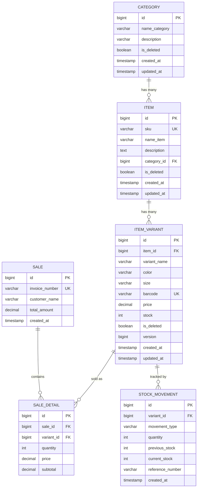

# Shop Warehouse Management API

A RESTful API built with **Spring Boot 3** for managing a shop's warehouse inventory — categories, items, item variants, stock, and sales transactions.

---

## Tech Stack

| Component        | Technology                          |
|-------------------|--------------------------------------|
| Language          | Java 17                              |
| Framework         | Spring Boot 3.5.5                    |
| Data Access       | Spring Data JPA (Hibernate)          |
| Database          | H2 (in-memory, default) / PostgreSQL |
| Validation        | Spring Validation (Jakarta Bean Validation) |
| API Documentation | springdoc-openapi (Swagger UI)        |
| Build Tool        | Maven                                 |
| Utility           | Lombok                                |

---

## Architecture

This project uses a **Layer-based (Package by Layer)** architecture — chosen for clarity and readability, since every layer (controller, service, repository, entity, dto) has one clear responsibility and is easy to navigate for anyone reviewing the code.

```
src/main/java/com/assessment/shop_warehouse_api/
├── ShopWarehouseApiApplication.java
│
├── common/                      # Cross-cutting concerns
│   ├── config/
│   │   ├── OpenApiConfig.java       # Swagger configuration
│   │   ├── JpaAuditingConfig.java   # Enables @CreatedDate / @LastModifiedDate
│   │   └── DataSeeder.java         # Seeds sample data on startup
│   ├── exception/
│   │   ├── GlobalExceptionHandler.java
│   │   ├── ResourceNotFoundException.java
│   │   ├── DuplicateResourceException.java
│   │   ├── InsufficientStockException.java
│   │   └── InternalServerException.java
│   └── response/
│       └── ApiResponse.java         # Standard { status, messages, data } envelope
│
├── controller/                  # REST endpoints (thin, delegates to service)
│   ├── CategoryController.java
│   ├── ItemController.java
│   ├── VariantController.java
│   ├── StockController.java
│   ├── SalesController.java
│   └── DashboardController.java
│
├── entity/                      # JPA entities
│   ├── Category.java
│   ├── Item.java
│   ├── ItemVariant.java
│   ├── Sale.java
│   ├── SaleDetail.java
│   ├── StockMovement.java
│   └── MovementType.java
│
├── repository/                  # Spring Data JPA repositories
│   ├── CategoryRepository.java
│   ├── ItemRepository.java
│   ├── ItemVariantRepository.java
│   ├── SaleRepository.java
│   ├── SaleDetailRepository.java
│   └── StockMovementRepository.java
│
├── service/                     # Service interfaces (contracts)
│   ├── CategoryService.java
│   ├── ItemService.java
│   ├── VariantService.java
│   ├── StockService.java
│   ├── SalesService.java
│   ├── DashboardService.java
│   └── impl/                    # Business logic + transaction boundaries
│       ├── CategoryServiceImpl.java
│       ├── ItemServiceImpl.java
│       ├── VariantServiceImpl.java
│       ├── StockServiceImpl.java
│       ├── SalesServiceImpl.java
│       └── DashboardServiceImpl.java
│
└── dto/                         # Request/response datas
    ├── CategoryDto.java
    ├── ItemDto.java
    ├── ItemVariantDto.java
    ├── StockAdjustmentDto.java
    ├── StockDto.java
    ├── SaleDto.java
    ├── SaleItemDto.java
    └── DashboardDto.java
```

---

## Database Design (ERD)



> Rendered automatically by GitHub / any Markdown viewer that supports Mermaid. If it doesn't render for you, view it at [mermaid.live](https://mermaid.live) by pasting the code block above.

**Notes:**
- `is_deleted` is used for soft delete on master data (`Category`, `Item`, `ItemVariant`). `Sale`, `SaleDetail`, and `StockMovement` are treated as immutable transaction history and are never deleted.
- `version` on `ItemVariant` enables **optimistic locking**, preventing race conditions when two concurrent sales compete for the same stock.

---

## API Endpoints

Base URL: `http://localhost:8081/api`

All responses follow this envelope:
```json
{
  "status": true,
  "messages": ["Category created successfully"],
  "data": { ... }
}
```

**Read-only fields:** some fields in the response (`id`, `categoryName`, `deleted`) are computed by the server and should **not** be sent in request bodies — they're ignored if present. Only send the fields actually needed to create/update a resource (e.g. `categoryId` when creating an Item, not `categoryName`).

**Common error responses** (same envelope, `status: false`):
| HTTP Status | When it happens |
|---|---|
| 400 Bad Request | Validation failed (missing/invalid field) or business rule violated (e.g. insufficient stock) |
| 404 Not Found | Referenced resource doesn't exist (e.g. unknown `categoryId`) |
| 409 Conflict | Duplicate unique field (SKU/barcode) or concurrent stock update conflict |
| 500 Internal Server Error | Unexpected error (database issue, etc.) |

Example — validation error:
```json
{
  "status": false,
  "messages": ["nameCategory: Nama kategori wajib diisi"],
  "data": null
}
```

Example — duplicate resource:
```json
{
  "status": false,
  "messages": ["SKU already exists: SKU-001"],
  "data": null
}
```

Example — concurrent stock update conflict (optimistic locking):
```json
{
  "status": false,
  "messages": ["Data sedang diproses oleh transaksi lain, silakan coba lagi"],
  "data": null
}
```

### Category
Groups items into broader classifications (e.g. Shoes, Apparel, Accessories). Every Item must belong to exactly one Category.

| Method | Endpoint                     | Description                    |
|--------|-------------------------------|--------------------------------|
| POST   | `/categories`                 | Create a category              |
| PUT    | `/categories/{id}`             | Update a category               |
| DELETE | `/categories/{id}`             | Soft-delete a category          |
| GET    | `/categories`                  | Get all active categories       |
| GET    | `/categories/deleted`          | Get all soft-deleted categories |
| GET    | `/categories/{id}`             | Get a category by ID            |

**Example — Create Category**
```
POST /api/categories
```
```json
{
  "nameCategory": "Sepatu",
  "description": "Sepatu casual dan olahraga"
}
```
Success:
```json
{
  "status": true,
  "messages": ["Category created successfully"],
  "data": {
    "id": 1,
    "nameCategory": "Sepatu",
    "description": "Sepatu casual dan olahraga",
    "deleted": false
  }
}
```

### Item
Represents a general product the shop sells (e.g. "Nike Air Max"). An Item itself has no price or stock — those live on its Variants. Use this when you need to manage the product catalog itself (name, SKU, description, category).

| Method | Endpoint                                 | Description                              |
|--------|--------------------------------------------|-------------------------------------------|
| POST   | `/items`                                    | Create an item                             |
| PUT    | `/items/{id}`                               | Update an item                              |
| DELETE | `/items/{id}`                               | Soft-delete an item                         |
| GET    | `/items?keyword=&page=&size=&sort=`          | Get all active items (paginated, searchable) |
| GET    | `/items/deleted`                            | Get all soft-deleted items                  |
| GET    | `/items/{id}`                               | Get an item by ID                           |

### Item Variant
A specific sellable version of an Item — e.g. "Nike Air Max, Black, Size 42". This is where **price**, **stock**, and **barcode** actually live, since the same Item can have many combinations of color/size, each priced and stocked separately.

| Method | Endpoint                              | Description                     |
|--------|-----------------------------------------|----------------------------------|
| POST   | `/items/{itemId}/variants`               | Create a variant for an item      |
| PUT    | `/variants/{id}`                         | Update a variant                  |
| DELETE | `/variants/{id}`                         | Soft-delete a variant             |
| GET    | `/items/{itemId}/variants`                | Get all active variants of an item |
| GET    | `/variants/deleted`                      | Get all soft-deleted variants       |
| GET    | `/variants?keyword=&page=&size=&sort=`   | Get all active variants (paginated, searchable by variant name) |
| GET    | `/variant/barcode/{barcode}`             | Get a variant by its barcode (used for barcode scanner lookups) |

**Example — Create Variant**
```
POST /api/items/1/variants
```
```json
{
  "variantName": "Black Size 42",
  "color": "Black",
  "size": "42",
  "barcode": "899111111111",
  "price": 1250000,
  "stock": 15
}
```
Success:
```json
{
  "status": true,
  "messages": ["Variant created successfully"],
  "data": {
    "id": 1,
    "itemId": 1,
    "variantName": "Black Size 42",
    "color": "Black",
    "size": "42",
    "barcode": "899111111111",
    "price": 1250000,
    "stock": 15,
    "deleted": false
  }
}
```

### Stock
Read and adjust the current stock level of any variant directly — useful for restocking, correcting counts, or spotting variants that are running low. Every adjustment here is logged as a `StockMovement` for audit purposes (see the ERD above).

| Method | Endpoint             | Description                              |
|--------|-----------------------|--------------------------------------------|
| GET    | `/stocks`             | Get current stock for all active variants   |
| GET    | `/stocks/low?threshold=10` | Get variants at or below the given threshold |
| POST   | `/stocks/adjustment`  | Manually adjust stock (in/out) with an audit trail |

### Sales
Records a customer transaction. Creating a sale automatically validates stock availability, deducts stock from each variant sold, calculates the total, and generates an invoice number — all in a single atomic operation. If any item in the request doesn't have enough stock, the **entire sale is rejected** (no partial sales).

| Method | Endpoint         | Description                                             |
|--------|-------------------|-----------------------------------------------------------|
| POST   | `/sales`           | Create a sale (validates & deducts stock, blocks if insufficient) |
| GET    | `/sales`           | Get all sales                                              |
| GET    | `/sales/{id}`      | Get a sale by ID                                            |

**Example — Create Sale**
```
POST /api/sales
```
```json
{
  "customerName": "Irfan",
  "items": [
    { "variantId": 1, "quantity": 2 },
    { "variantId": 3, "quantity": 1 }
  ]
}
```
Success:
```json
{
  "status": true,
  "messages": ["Sale completed successfully"],
  "data": {
    "invoiceNumber": "INV-202608020001",
    "totalAmount": 3140000
  }
}
```
Error (insufficient stock):
```json
{
  "status": false,
  "messages": ["Insufficient stock for variant Black Size 42"],
  "data": null
}
```

### Dashboard
A quick, read-only overview of the warehouse's current state — handy for a landing page or admin summary widget.

| Method | Endpoint      | Description                                              |
|--------|----------------|-------------------------------------------------------------|
| GET    | `/dashboard`   | Summary: total items, total variants, low stock count, today's sales |

---

## Getting Started

### Prerequisites
- **Java 17** or higher
- **Maven** (or use the bundled `./mvnw` wrapper)
- No external database required — the app runs out of the box on an **H2 in-memory database**.

### 1. Clone the repository
```bash
https://github.com/Fadillah272/warehouse.git
cd warehouse
```

### 2. Run the application

**Option A — Command line**
```bash
./mvnw spring-boot:run
```
or, if you have Maven installed globally:
```bash
mvn spring-boot:run
```

**Option B — IntelliJ IDEA**
1. Open the project folder (`File > Open...`), select the folder containing `pom.xml`
2. Let IntelliJ auto-import the Maven dependencies (bottom-right notification, or `Reload All Maven Projects` in the Maven tool window)
3. Locate `ShopWarehouseApiApplication.java` (`src/main/java/com/assessment/shop_warehouse_api/`)
4. Click the green **Run** ▶ button next to the `main` method, or right-click the file → **Run 'ShopWarehouseApiApplication'**

The app starts on **`http://localhost:8081`** by default.

### 3. Sample data
On every startup, `DataSeeder` automatically populates the database with sample data (only if it's empty):
- 3 categories
- 5 items
- 10 item variants — including low-stock and out-of-stock examples, useful for testing the "prevent selling out-of-stock" rule right away.

### 4. Explore the API
- **Swagger UI**: `http://localhost:8081/swagger-ui/index.html`
  (e.g. `http://localhost:8081/swagger-ui/index.html#/sales-controller/getAllSale` to jump directly to a specific endpoint)
- **H2 Console**: `http://localhost:8081/h2-console`
  - JDBC URL: `jdbc:h2:mem:warehouse`
  - Username: `sa`
  - Password: *(leave blank)*

### 5. (Optional) Switch to PostgreSQL
Update `src/main/resources/application.properties`:
```properties
spring.datasource.url=jdbc:postgresql://localhost:5432/warehouse
spring.datasource.driver-class-name=org.postgresql.Driver
spring.datasource.username=postgres
spring.datasource.password=yourpassword
spring.jpa.database-platform=org.hibernate.dialect.PostgreSQLDialect
```
Make sure the `warehouse` database already exists (`CREATE DATABASE warehouse;`) before starting the app.

---

## Troubleshooting

**H2 Console shows "Database not found" error**
Make sure you're using the H2 Console **built into the running Spring Boot app** (`http://localhost:8081/h2-console`), not a standalone H2 application — the in-memory database only exists inside the app's own JVM process while it's running. Also double-check the **JDBC URL field on the login page** matches `application.properties` exactly: `jdbc:h2:mem:warehouse`.

**Pagination (`sort`) shows as a raw JSON box in Swagger instead of separate fields**
Add this property so springdoc renders `Pageable` as separate `page` / `size` / `sort` query fields:
```properties
springdoc.model-converters.pageable-converter.enabled=true
```

**`PropertyReferenceException: No property 'x' found for type 'Y'`**
This means the `sort` value you passed doesn't match an actual field name on that entity. For example, `/api/variants?sort=nameItem,asc` fails because `nameItem` belongs to `Item`, not `ItemVariant` — use `sort=variantName,asc` instead (or `sort=item.nameItem,asc` to sort by the parent Item's name via the relation).

**PostgreSQL: `password authentication failed`**
This is a local database credential/config issue, unrelated to the app code. Verify you can log in manually (`psql -U postgres -h localhost`), that the `warehouse` database exists, and that `pg_hba.conf` allows password auth for local connections. If in doubt, just use the default H2 in-memory setup — no external database needed.

---

## Assumptions
- Every Item belongs to exactly one Category.
- Every Item may have multiple Variants (e.g. different sizes/colors), and only Variants carry price and stock — not the Item itself.
- A Sale can only be created if all requested variants have sufficient stock; otherwise the entire sale is rejected (no partial sales).
- Every stock change (adjustment or sale) is recorded in `StockMovement` for auditability.
- Soft delete applies to master data (Category, Item, Variant) so historical references (e.g. past sales) are never broken. Sales and stock movements are immutable and are never deleted.

## Design Decisions
- **Layer-based architecture** (controller / service / repository / entity / dto) for readability and easy onboarding — each layer has a single, obvious responsibility.
- **Standard response envelope** (`ApiResponse<T>`) across all endpoints for predictable client-side handling.
- **Optimistic locking** (`@Version` on `ItemVariant`) to prevent overselling when multiple sales race for the same stock concurrently.
- **Global exception handling** (`@RestControllerAdvice`) so business errors (not found, duplicate, insufficient stock) return clean, consistent JSON responses instead of raw stack traces.
- **Soft delete** instead of hard delete for master data, to preserve referential integrity with historical sales records.
- **H2 in-memory by default** for zero-setup evaluation, with PostgreSQL supported via a simple property change for production use.

## Future Improvements
- Authentication & Authorization (JWT)
- Docker Compose for one-command startup (app + PostgreSQL)
- Unit & integration tests
- Redis caching for dashboard summary
- Event-driven stock notifications (e.g. low stock alerts)
